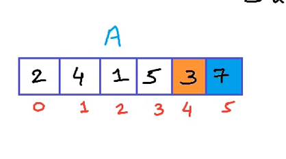
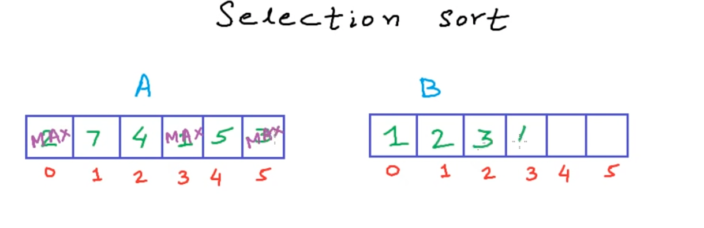
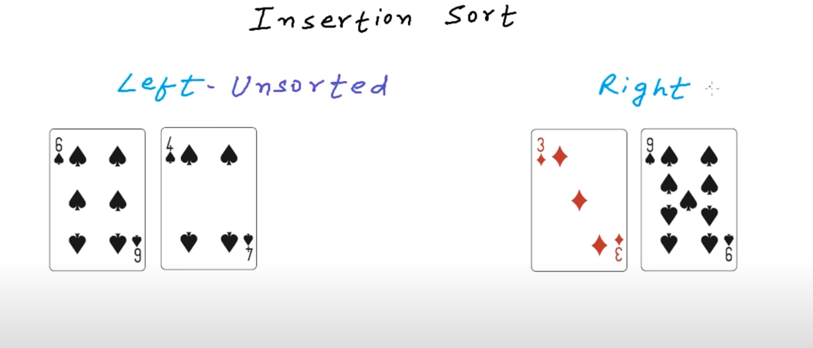
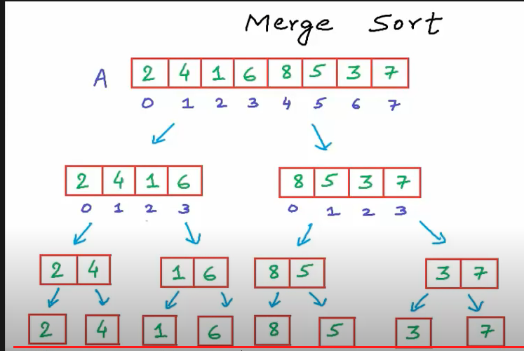
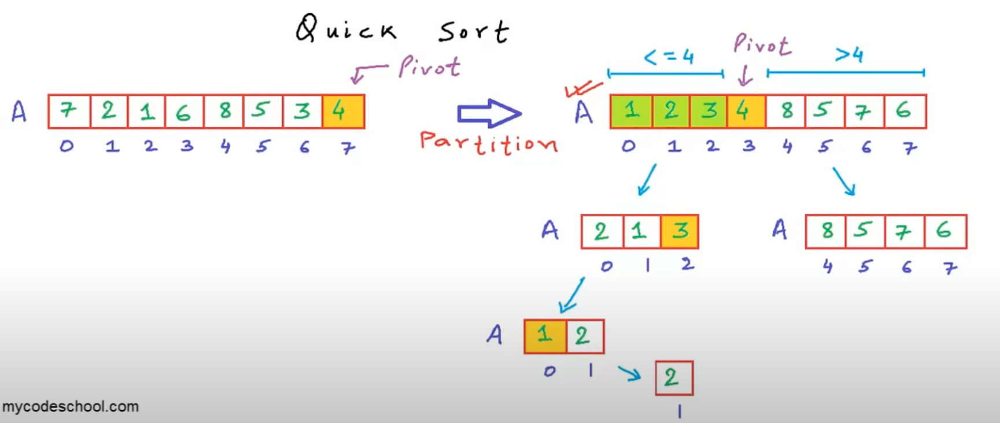
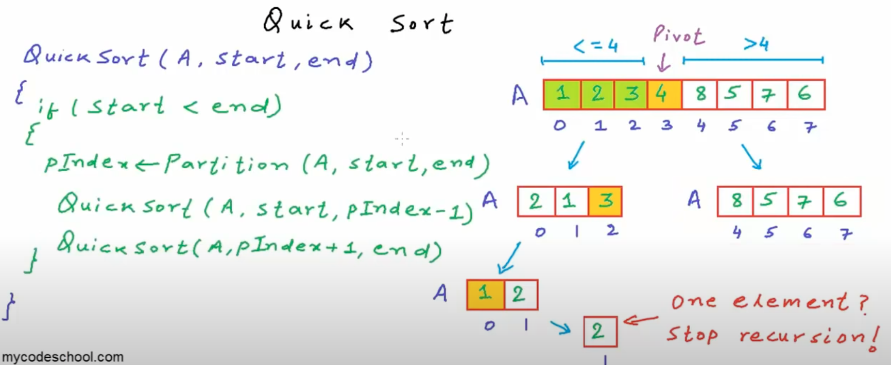

bubble sort

```javascript
/**
 * O(n*2)
 */
function bubbleSort(arr) {
    // your code here
    for (let i = 0; i < arr.length; i++) {
        for (let j = i + 1; j < arr.length; j++) {
            // 每一个挨着比较，小的沉下来
            if (arr[i] > arr[j]) {
                [arr[i], arr[j]] = [arr[j], arr[i]];
            }
        }
    }
}
```

selection sort

```javascript
/**
 * O(n**2)
*/
function selectionSort(arr) {
    // 0 -> i 是sorted
    for (var i = 0; i < arr.length; i++) {
        // 从i+1往后都是unsorted.每次都找到unsorted里面找到最小的，赋值给i
        for (var j = i + 1; j < arr.length; j++) {
            if (arr[j] < arr[i]) {
                [arr[i], arr[j]] = [arr[j], arr[i]];
            }
        }
    }
}
```

insertion sort

```javascript
/**
 * Best: O(n) 在array正好已经sorted情况下[1,2,3,4,5]
 * Average: O(n^2)
 * Worst: O(n^2) 在array正好相反下[5,4,3,2,1];
 * 实际上比较快
*/
function insertionSort(arr) {
    // 外围从 1开始
    for (let i = 1; i < arr.length; i++) {
        const current = arr[i];
        let j = i - 1;
        while (j >= 0) {
            if (arr[j] <= current) break;
            arr[j+1] = arr[j];
            j--;
        }
        arr[j+1] = current;
    }
}
```
-------------------------------------------------------------------------

merge sort

```javascript
/**
 * O(n * log(n)) time
 * O（n） space not in place
 */
function mergeSort(arr) {
    // your code here
    if (arr.length < 2) return;

    let middle = Math.floor(arr.length / 2);
    let left = arr.slice(0, middle);
    let right = arr.slice(middle);

    mergeSort(left);
    mergeSort(right);

    let leftIndex = 0;
    let rightIndex = 0;

    while (leftIndex < left.length || rightIndex < right.length) {
        if (
            rightIndex === right.length ||                                          //right array为空
            (leftIndex < left.length && left[leftIndex] <= right[rightIndex])       //或者left有 且 left 小于 right
        ) {
            arr[leftIndex + rightIndex] = left[leftIndex++];
        } else {
            arr[leftIndex + rightIndex] = right[rightIndex++];
        }
    }
}
```

quick sort


```javascript
/**
 * Average O(nlogn)
 * Worst O(n**2)
 * In place
 * 实际上比较快，js的array sort 就是quick sort
*/
这个implementation不太对！！！！！！！
function quickSort(arr, left = 0, right = arr.length - 1) {
    // your code here
    if (left > right) return;
    const pivot = partition(arr, left, right);
    quickSort(arr, left, pivot - 1);
    quickSort(arr, pivot + 1, right);
}

function partition(arr, left, right) {
    const pivotIndex = Math.floor(Math.random() * (right - left)) + left;
    let pivot = arr[pivotIndex];
    while (left <= right) {
        if (arr[left] <= pivot) {
            left++;
        } else {
            [arr[left], arr[right]] = [arr[right], arr[left]];
            right--;
        }
    }
    //这是为什么
    [arr[pivotIndex], arr[right]] = [arr[right], arr[pivotIndex]];
    return right;
}
```

