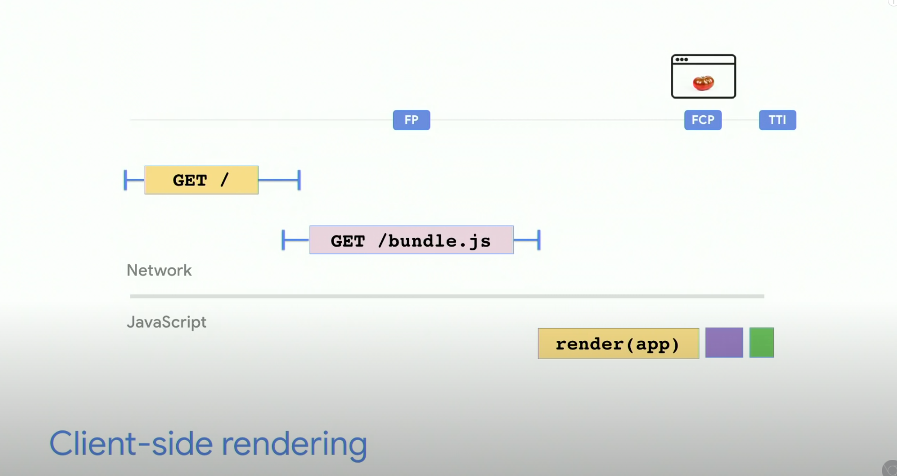

**Performance Budget**
比如 < 2s 的 TTI（time to interactive）
或者Resource 小于150KB

-----

[改进performance的方法：](https://web.dev/fast/)
1. Optimize images
2. Lazy load
3. Optimize JS
4. Optimize CSS
5. Optimize 3rd party library
6. Optimize web fonts
7. resource delivery

-----

lazy load images with js
不着急显示的img就后load
```javascript
 
// auto就是让browser决定
```
iframe现在也有同样的loading设置

改进image的方法
1. 不同情况display不同pixel的图片 `srcset`
2. image CDN

-------
```html
<link rel="preload" href="url" as="style | script"> 
```

// 说明这个是现在page就需要的，需要提前load好
prefetch必须是是下个page用的，在去下个page前有空的话就提前load
preconnect 提前connect

https://medium.com/reloading/preload-prefetch-and-priorities-in-chrome-776165961bbf

------
**PRPL** pattern => Push(using preload), Render, Pre-Cache(service worker), Lazy load(async split routes)

-------



-------

1. Audit the site(chrome devtool)


-------
**SSR + Hydration**
就是先用server side render 展示FCP(first contentful paint),这样快，因为是Server generate好的html load出来不用JS就可以直接display
然后再慢慢load一个client js app来replace 再展现个client app
